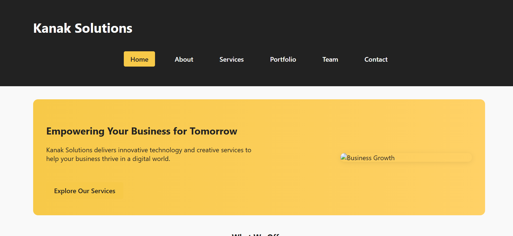

# Kanak Solutions Multi-Page Website

A modern, attractive, and fully responsive static website for a technology and creative services company. Built with clean HTML and CSS, featuring reusable components, a consistent layout, and a professional look.

## Features
- 6 pages: Home, About, Services, Portfolio, Team, Contact
- Consistent header, navbar, and footer across all pages
- Single `style.css` for all styles (hero, cards, testimonials, team, etc.)
- Responsive and mobile-friendly design
- Navigation with active page highlighting
- Modern hero section, testimonials, and call-to-action
- Organized folders for images and CSS
- Placeholder images and icons for easy customization

## Live Demo
[View Live Site](https://multipage-ui.vercel.app/) 

## Screenshot
 

## Structure
```
/
  index.html
  about.html
  services.html
  portfolio.html
  team.html
  contact.html
  /css/style.css
  /css/active-nav.js
  /images/
  README.md
```
